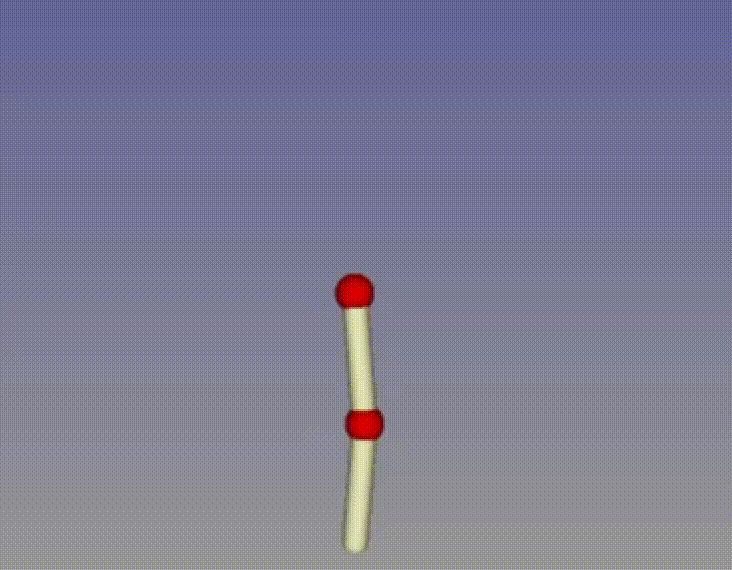

# DQN Algorithm N-Pendulum Swing-Up
 
## Introduction
This project aims at implementing the DQN algorithm to solve the single and double pendulum swing-up problem. It uses Pinocchio library to compute the dynamics of the system and Gepetto Viewer to visualize the system. The DQN algorithm is implemented using Tensorflow 2.12.

## Installation
### Dependencies
- [Pinocchio](https://stack-of-tasks.github.io/pinocchio/download.html)
- [Gepetto Viewer](https://gepettoweb.laas.fr/hpp/gepetto-viewer/doxygen-html/index.html)

### Requirements
- [Python 3.8](https://www.python.org/downloads/)
- numpy==1.23.5
- tensorflow==2.12.0
- matplotlib==3.7.1
- seaborn==0.12.2

### Installation
#### Ubuntu 20.04
```bash
git clone https://github.com/PeriniM/DQN-SwingUp.git
cd ORC_Assignment_3/code
python -m venv env
source env/bin/activate
pip install -r requirements.txt
```
#### Windows
Pinocchio and Gepetto Viewer are not available. You can either install them in a UNIX environment (WSL, Anaconda etc.) or use the FakeEnv class to emulate a random environment for testing purposes. In this case, you need to follow the same steps for Ubuntu 20.04 and set the environment flag in the main.py file as follows:
```python
isFake = True
```
## [Documentation](https://perinim.github.io/DQN-SwingUp/)

## Project Structure
- 📄[main.py](main.py)
- ⚙️[config.ini](config.ini)
- 📂[DQN](DQN)
    - 📄[Agent.py](DQN/Agent.py)
    - 📄[DeepQNetwork.py](DQN/DeepQNetwork.py)
    - 📄[ReplayBuffer.py](DQN/ReplayBuffer.py)
- 📂[Environments](Environments)
    - 📄[Pendulum.py](Environments/Pendulum.py)
    - 📄[Display.py](Environments/Display.py)
    - 📄[FakeEnv.py](Environments/FakeEnv.py)
- 📂[saved_weights](saved_weights)
- 📂[saved_metrics](saved_metrics)
- 📂[final_results](final_results)

## Usage
- Set the parameters in the config.ini file
- Set the environment and the number of joints in the main.py file
- Set the train, evaluate and plot_colormaps flags in the main.py file
- Run the main.py file

## Papers
- [Human-level control through deep reinforcement learning](https://www.nature.com/articles/nature14236)
- [Implementing the Deep Q-Network](https://arxiv.org/pdf/1711.07478.pdf)

## License
[MIT](https://choosealicense.com/licenses/mit/)
